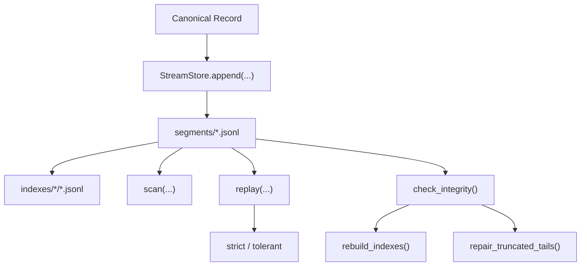

<div align="center">
  <h1>📜 Stream</h1>
  <p><em>ML Observability를 위한 Append 지향 정본 레코드 저장소</em></p>

  [](https://github.com/eastlighting1/Stream/actions/workflows/checks.yml)
  [](./pyproject.toml)
  [](https://github.com/astral-sh/ruff)

  [**English**](./README.md) · [**한국어**](./README.ko.md)
</div>

---

**Stream**은 ML observability 스택의 append 지향 정본 레코드 저장소입니다.

이 라이브러리는 Python 코드가 정본 observability 레코드를 순서가 보존된 JSONL 세그먼트 기록으로 로컬에 저장하고, 명시적인 무결성 의미론 아래에서 그 기록을 재생하고, 다른 도구가 JSONL을 필요로 할 때 재생 결과를 내보내고, helper state를 source of truth로 오해하지 않으면서 알려진 손상된 tail 사례를 복구할 수 있도록 해줍니다.

정본 runtime history가 제각각의 JSON 파일, 반쯤 구조화된 로그, 일회성 로컬 스크립트로 흩어지게 두는 대신, Stream은 정본 기록을 보존하고, 읽고, 재생하고, 복구하기 위한 **하나의 inspectable local record store**를 제공합니다.

## Why Stream

정본 runtime history는 대체로 같은 지점에서 모호해집니다.

- 어떤 레코드가 실제로 로컬에 수용되었는가
- 그 레코드가 어떤 append 순서로 들어왔는가
- 읽기가 direct scan이어야 하는가, integrity-aware replay여야 하는가
- 손상된 로컬 history를 여전히 안전하게 해석할 수 있는가
- helper index가 여전히 canonical segment를 반영하는가
- 손상된 tail을 과거를 조용히 다시 쓰지 않고 어떻게 다뤄야 하는가

> **Stream은 로컬 정본 history를 명시적이고, 순서가 있고, inspectable하며, repairable하게 유지하기 위해 존재합니다.**

Stream을 사용하면 팀은 다음을 다룰 수 있습니다.

- **Canonical Record History:** 정본 레코드를 위한 순서 보존 JSONL segment entry
- **Practical Read Surfaces:** `scan()`, `replay()`, `iter_replay()`, 그리고 JSONL export
- **Integrity Surfaces:** health 분류, 구체적인 issue, operator recommendation
- **Maintenance Surfaces:** derivative index rebuild와 신중한 truncated-tail repair
- **Inspectable Local Layout:** `manifest.json`, `segments/`, `indexes/`, `quarantine/`

## Core Ideas

Stream은 로컬 history 흐름으로 이해하는 것이 가장 쉽습니다. 정본 레코드는 순서대로 append되고, helper index는 그 history에서 파생되며, 읽기는 저장된 history를 inspect하거나 replay하고, integrity check는 손상된 history가 strict interpretation을 막아야 하는지를 판단합니다.



### Strong Defaults

- `segments/`를 canonical truth로 취급합니다.
- `indexes/`를 derivative helper로 취급합니다.
- direct inspection에는 `scan()`을, integrity-aware interpretation에는 `replay()`를 사용합니다.
- integrity check를 드문 비상 도구가 아니라 일상적인 동작으로 취급합니다.
- repair를 가벼운 cleanup이 아니라 제한된 canonical intervention으로 취급합니다.

## Installation

저장소를 클론합니다.

```bash
git clone https://github.com/eastlighting1/Stream.git
cd Stream
```

로컬 개발용으로 editable mode 설치:

```bash
pip install -e .
```

설치 확인:

```bash
python -c "import stream; print(stream.__file__)"
```

테스트 실행:

```bash
pytest
```

## Quick Start

기본 Stream 사용 루프는 단순합니다. **1) 하나의 로컬 store를 연다 -> 2) canonical record를 append한다 -> 3) 로컬 history를 scan 또는 replay한다 -> 4) health가 중요할 때 integrity check를 실행한다.**

```python
from pathlib import Path

from stream import ReplayMode, ScanFilter, StoreConfig, StreamStore

store = StreamStore.open(StoreConfig(root_path=Path(".stream-store")))

append_result = store.append(
    {
        "record_ref": "record/eval-start",
        "record_type": "structured_event",
        "recorded_at": "2026-04-03T00:10:00Z",
        "observed_at": "2026-04-03T00:10:00Z",
        "producer_ref": "scribe.python.local",
        "run_ref": "run/eval-1",
        "stage_execution_ref": "stage/evaluate",
        "operation_context_ref": "op/evaluate-open",
        "correlation_refs": {"trace_id": "trace/eval-1"},
        "completeness_marker": "complete",
        "degradation_marker": "none",
        "schema_version": "1.0.0",
        "payload": {
            "event_key": "evaluation.started",
            "level": "info",
            "message": "Evaluation started.",
        },
    }
)

records = list(store.scan(ScanFilter(run_ref="run/eval-1")))
replay = store.replay(ScanFilter(run_ref="run/eval-1"), mode=ReplayMode.STRICT)
integrity = store.check_integrity()

print(append_result.success, len(records), replay.record_count, integrity.state)
```

이 흐름은 Stream의 의도된 순서를 보여줍니다.

1. 하나의 로컬 store boundary를 연다
2. canonical history를 명시적으로 append한다
3. `scan()` 또는 `replay()`로 그 history를 읽는다
4. strict interpretation이 정당한지 integrity state로 판단한다

## Public API Shape

Top-level:

- `StreamStore`
- `StoreConfig`
- `ScanFilter`
- `ReplayMode`
- `DurabilityMode`
- `LayoutMode`
- `AppendResult`
- `ReplayResult`
- `IntegrityReport`
- `RepairReport`

Store-level:

- `store.append(...)`
- `store.append_many(...)`
- `store.scan(...)`
- `store.replay(...)`
- `store.iter_replay(...)`
- `store.export_jsonl(...)`
- `store.check_integrity()`
- `store.rebuild_indexes()`
- `store.repair_truncated_tails()`

CLI:

- `stream-cli scan`
- `stream-cli replay`
- `stream-cli export`
- `stream-cli integrity`
- `stream-cli rebuild-indexes`
- `stream-cli repair`

## Local-First Inspection

Stream은 canonical history를 디스크에서 직접 inspect할 수 있게 유지합니다.

- `manifest.json`
  - append frontier와 로컬 operating state
- `segments/segment-*.jsonl`
  - canonical append history
- `indexes/run_ref/*.jsonl`
  - derivative helper pointer
- `indexes/stage_execution_ref/*.jsonl`
  - derivative helper pointer
- `indexes/record_type/*.jsonl`
  - derivative helper pointer
- `quarantine/`
  - repair 중 생성된 손상 segment 보관본

이 구조 덕분에 팀은 helper state를 authoritative truth로 바꾸지 않고도 canonical history를 로컬에서 실용적으로 inspect할 수 있습니다.

## What Stream Stores

- canonical observability record history
- sequence number를 통한 append order
- 로컬 append progress를 위한 manifest state
- practical scan을 위한 derivative helper index
- integrity finding과 repair-oriented local state

## What Stream Does Not Store

- `Ledger`가 맡아야 하는 structural anchor truth
- `Spine`이 맡아야 하는 contract definition
- artifact body byte
- dashboard semantic
- canonical history를 대체하는 analytical projection

## Documentation

Stream의 write model, read semantic, storage layout, integrity behavior, CLI, API, example을 더 보려면 아래 문서를 참고하세요.

| 가이드 | English | Korean |
|---|---|---|
| **Main Guide** | [USER_GUIDE.en.md](./docs/USER_GUIDE.en.md) | [USER_GUIDE.ko.md](./docs/USER_GUIDE.ko.md) |
| **API Reference** | [api-reference.md](./docs/en/api-reference.md) | [api-reference.md](./docs/ko/api-reference.md) |
| **CLI Reference** | [cli-reference.md](./docs/en/cli-reference.md) | [cli-reference.md](./docs/ko/cli-reference.md) |

**권장 읽기 순서:**

1. [User Guide](./docs/USER_GUIDE.ko.md)
2. [Getting Started](./docs/ko/getting-started.md)
3. [Mental Model](./docs/ko/mental-model.md)
4. [Write Path](./docs/ko/write-path.md)
5. [Read Path](./docs/ko/read-path.md)
6. [Layout and Storage](./docs/ko/layout-and-storage.md)
7. [Integrity and Repair](./docs/ko/integrity-and-repair.md)
8. [Examples](./docs/ko/examples.md)
9. [CLI Reference](./docs/ko/cli-reference.md)
10. [API Reference](./docs/ko/api-reference.md)
11. [FAQ](./docs/ko/faq.md)

## Repository Layout

- `src/stream`: 공개 패키지와 구현
- `examples`: 실행 가능한 local-store example
- `tests`: append, replay, integrity, repair 테스트
- `docs`: 사용자 가이드와 상세 문서

## Current Status

이 저장소는 아직 초기 단계지만, 핵심 로컬 store surface는 이미 동작합니다.

- canonical append history persistence
- ordered scan 및 replay surface
- strict / tolerant replay behavior
- JSONL export
- integrity classification 및 issue reporting
- derivative index rebuild
- cautious truncated-tail repair
