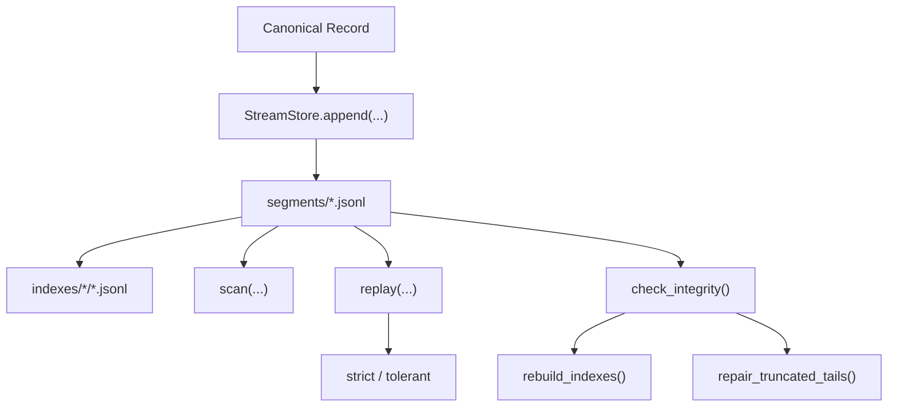

<div align="center">
  <h1>📜 Stream</h1>
  <p><em>An Append-Oriented Canonical Record Store for ML Observability</em></p>

  [](https://github.com/eastlighting1/Stream/actions/workflows/checks.yml)
  [](./pyproject.toml)
  [](https://github.com/astral-sh/ruff)

  [**English**](./README.md) · [**한국어**](./README.ko.md)
</div>

---

**Stream** is the append-oriented canonical record store of the ML observability stack.

It gives Python code a local-first way to persist canonical observability records as ordered JSONL segment history, replay that history under explicit integrity semantics, export replayed slices when another tool needs JSONL, and recover from known damaged-tail cases without pretending helper state is the source of truth.

Instead of letting canonical runtime history drift across ad hoc JSON files, partially structured logs, and one-off local scripts, Stream provides **one inspectable local record store** for preserving, reading, replaying, and repairing canonical history deliberately.

## Why Stream

Canonical runtime history usually becomes ambiguous in the same places:

- which records were actually accepted locally
- what append order those records entered in
- whether a read should be a direct scan or an integrity-aware replay
- whether damaged local history can still be interpreted safely
- whether helper indexes still reflect canonical segments
- how a damaged tail should be handled without silently rewriting the past

> **Stream exists to keep local canonical history explicit, ordered, inspectable, and repairable.**

With Stream, teams can work with:

- **Canonical Record History:** ordered JSONL segment entries for canonical records
- **Practical Read Surfaces:** `scan()`, `replay()`, `iter_replay()`, and JSONL export
- **Integrity Surfaces:** health classification, concrete issues, and operator recommendations
- **Maintenance Surfaces:** derivative index rebuilds and cautious truncated-tail repair
- **Inspectable Local Layout:** `manifest.json`, `segments/`, `indexes/`, and `quarantine/`

## Core Ideas

Stream is easiest to understand through its local history flow. Canonical records are appended in order, helper indexes are derived from that history, reads either inspect or replay the stored history, and integrity checks decide whether damaged history should block strict interpretation.



### Strong Defaults

- Treat `segments/` as canonical truth.
- Treat `indexes/` as derivative helpers.
- Use `scan()` for direct inspection and `replay()` for integrity-aware interpretation.
- Treat integrity checks as ordinary operation rather than rare emergency tooling.
- Treat repair as a narrow canonical intervention, not as casual cleanup.

## Installation

Clone the repository:

```bash
git clone https://github.com/eastlighting1/Stream.git
cd Stream
```

For local development, install the package in editable mode:

```bash
pip install -e .
```

To verify the installation:

```bash
python -c "import stream; print(stream.__file__)"
```

To run the test suite:

```bash
pytest
```

## Quick Start

The basic Stream usage loop is simple: **1) Open one local store -> 2) Append canonical records -> 3) Scan or replay the local history -> 4) Run integrity checks when health matters.**

```python
from pathlib import Path

from stream import ReplayMode, ScanFilter, StoreConfig, StreamStore

store = StreamStore.open(StoreConfig(root_path=Path(".stream-store")))

append_result = store.append(
    {
        "record_ref": "record/eval-start",
        "record_type": "structured_event",
        "recorded_at": "2026-04-03T00:10:00Z",
        "observed_at": "2026-04-03T00:10:00Z",
        "producer_ref": "scribe.python.local",
        "run_ref": "run/eval-1",
        "stage_execution_ref": "stage/evaluate",
        "operation_context_ref": "op/evaluate-open",
        "correlation_refs": {"trace_id": "trace/eval-1"},
        "completeness_marker": "complete",
        "degradation_marker": "none",
        "schema_version": "1.0.0",
        "payload": {
            "event_key": "evaluation.started",
            "level": "info",
            "message": "Evaluation started.",
        },
    }
)

records = list(store.scan(ScanFilter(run_ref="run/eval-1")))
replay = store.replay(ScanFilter(run_ref="run/eval-1"), mode=ReplayMode.STRICT)
integrity = store.check_integrity()

print(append_result.success, len(records), replay.record_count, integrity.state)
```

This flow demonstrates the intended Stream order:

1. open one local store boundary
2. append canonical history explicitly
3. inspect that history through `scan()` or `replay()`
4. use integrity state to decide whether strict interpretation is justified

## Public API Shape

Top-level:

- `StreamStore`
- `StoreConfig`
- `ScanFilter`
- `ReplayMode`
- `DurabilityMode`
- `LayoutMode`
- `AppendResult`
- `ReplayResult`
- `IntegrityReport`
- `RepairReport`

Store-level:

- `store.append(...)`
- `store.append_many(...)`
- `store.scan(...)`
- `store.replay(...)`
- `store.iter_replay(...)`
- `store.export_jsonl(...)`
- `store.check_integrity()`
- `store.rebuild_indexes()`
- `store.repair_truncated_tails()`

CLI:

- `stream-cli scan`
- `stream-cli replay`
- `stream-cli export`
- `stream-cli integrity`
- `stream-cli rebuild-indexes`
- `stream-cli repair`

## Local-First Inspection

Stream keeps canonical history directly inspectable on disk.

- `manifest.json`
  - append frontier and local operating state
- `segments/segment-*.jsonl`
  - canonical append history
- `indexes/run_ref/*.jsonl`
  - derivative helper pointers
- `indexes/stage_execution_ref/*.jsonl`
  - derivative helper pointers
- `indexes/record_type/*.jsonl`
  - derivative helper pointers
- `quarantine/`
  - preserved damaged segment copies created during repair

This gives teams a practical local workflow for inspecting canonical history without turning helper state into authoritative truth.

## What Stream Stores

- canonical observability record history
- append order through sequence numbers
- manifest state for local append progress
- derivative helper indexes for practical scans
- integrity findings and repair-oriented local state

## What Stream Does Not Store

- structural anchor truth that belongs in `Ledger`
- contract definitions that belong in `Spine`
- artifact body bytes
- dashboard semantics
- analytical projections that replace canonical history

## Documentation

Dive deeper into Stream's write model, read semantics, storage layout, integrity behavior, CLI, API, and examples:

| Guide | English | Korean |
|---|---|---|
| **Main Guide** | [USER_GUIDE.en.md](./docs/USER_GUIDE.en.md) | [USER_GUIDE.ko.md](./docs/USER_GUIDE.ko.md) |
| **API Reference** | [api-reference.md](./docs/en/api-reference.md) | [api-reference.md](./docs/ko/api-reference.md) |
| **CLI Reference** | [cli-reference.md](./docs/en/cli-reference.md) | [cli-reference.md](./docs/ko/cli-reference.md) |

**Recommended Reading Path:**

1. [User Guide](./docs/USER_GUIDE.en.md)
2. [Getting Started](./docs/en/getting-started.md)
3. [Mental Model](./docs/en/mental-model.md)
4. [Write Path](./docs/en/write-path.md)
5. [Read Path](./docs/en/read-path.md)
6. [Layout and Storage](./docs/en/layout-and-storage.md)
7. [Integrity and Repair](./docs/en/integrity-and-repair.md)
8. [Examples](./docs/en/examples.md)
9. [CLI Reference](./docs/en/cli-reference.md)
10. [API Reference](./docs/en/api-reference.md)
11. [FAQ](./docs/en/faq.md)

## Repository Layout

- `src/stream`: public package and implementation
- `examples`: runnable local-store examples
- `tests`: append, replay, integrity, and repair tests
- `docs`: user guides and detailed documentation

## Current Status

This repository is still early-stage, but the core local store surface is already operational:

- canonical append history persistence
- ordered scan and replay surfaces
- strict and tolerant replay behavior
- JSONL export
- integrity classification and issue reporting
- derivative index rebuilds
- cautious truncated-tail repair
